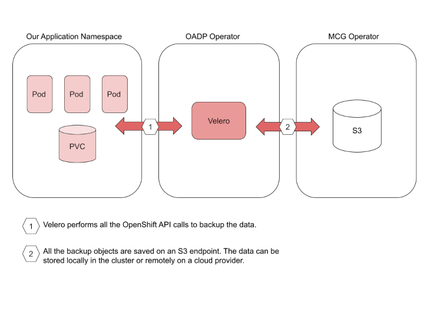

# Backup OpenShift applications using the OpenShift API for Data Protection with Multicloud Object Gateway

By: saledort@redhat.com, dchavero@redhat.com

Looking for a tool to back up your OpenShift applications? OADP is what you need. 

Having a backup of your data can be critical in case of an unplanned event. Using a backup allows data to be restored quickly to help the business recover while avoiding downtime and data loss. OpenShift API for Data Protection (OADP) offers features for backing up and restoring applications.

OADP backs up Kubernetes objects and internal images by saving them as an archive file on object storage. OADP backs up persistent volumes (PVs) by creating snapshots. You can restore all objects in a backup or filter the restored objects by namespace, PV, or label. You can schedule backups at specified intervals.

The default OADP plugins enable Velero, a tool that’s used to integrate with certain cloud providers and to back up and restore OpenShift Container Platform resources.

The focus of this blog is OADP with Multicloud Object Gateway (MCG), a component of OpenShift Data Foundation that we will use as a backup location in this article.

Next, we present the available components and custom resources, how to operate OADP and store a backup in a local S3 object storage.

More info about OADP can be found in the official [OpenShift 4.12 documentation](https://docs.openshift.com/container-platform/4.12/backup_and_restore/application_backup_and_restore/oadp-release-notes.html) page.

# Concepts and components



## OpenShift applications

OpenShift is a container orchestrator, hence when we talk about OpenShift applications we refer to all the OpenShift objects, normally in the context of a Namespace, such as your running containerized applications (Deployments, ReplicaSets, DaemonSets, etc…), all the configurations (ConfigMaps, Secrets), the required networking (Services, Routes, etc) and the persistent volumes of data generated by your application (PersistentVolumeClaims). All those objects and data are what make up an application, and what is needed to be in a backup in order to be able to restore it in case of a failure.

## Velero

Velero is an open source tool used to back up and restore Kubernetes cluster resources and persistent volumes. 

As described in the Velero project:

> “Velero lets you:
> * Take backups of your cluster and restore in case of loss.
> * Migrate cluster resources to other clusters.
> * Replicate your production cluster to development and testing clusters.
> 
> Velero consists of:
> * A server that runs on your cluster
> * A command-line client that runs locally”
> 

We will use Velero to back up cluster resources to a local S3 object storage. The OADP Operator installs Velero in the Openshift cluster.

## S3 storage

For some years now S3 (Simple Storage Service) has been the standard API to store objects remotely, making it one of the best options to store backup objects. This API created by Amazon some years ago, and now is implemented by different products, including the Red Hat offering with OpenShift Data Foundation. One of the OpenShift Data Foundation components is Multicloud Object Gateway (MCG), which implements an S3 storage based on NooBaa (additional info below). S3 is implemented in almost all the principal cloud providers, hence it is the easiest way to save your backup objects.

## Multicloud Object Gateway (MCG)

As mentioned before, MCG is a product in the Red Hat portfolio that implements an S3 object storage API. MCG is part of the OpenShift Data Foundation operator, which implements a storage solution on OpenShift. 

MCG is based on the NooBaa open source project:

> “NooBaa is an object data service for hybrid and multi cloud environments. NooBaa runs on kubernetes, provides an S3 object store service (and Lambda with bucket triggers) to clients both inside and outside the cluster, and uses storage resources from within or outside the cluster, with flexible placement policies to automate data use cases.”
>

In this article, we will use MCG to create an S3 endpoint where we can store all the backup objects generated by Velero, and present how to configure an S3 bucket to store the backup locally in the cluster.

# Prerequisites

## OpenShift Data Foundation operator

OpenShift Data Foundation (ODF) is required to support features used by OADP like CSI snapshots, or the creation of an S3 bucket to store the backup objects. ODF can be installed using OLM as described in the [official documentation](https://access.redhat.com/documentation/en-us/red_hat_openshift_data_foundation/4.12). Please note, ODF is a meta operator, installing OCS and MCG operators, hence all the NooBaa references in this article are installed with ODF.

## Application deployment

In this article, we will use a simple hello-openshift application under a testing namespace that’s creating a file in the cluster storage. The application will be deleted and restored from a backup together with the storage using OADP.

First, create the test namespace:

```bash
$ oc create namespace test-oadp
```

Apply the following configuration to create a PersistentVolumeClaim, a storage request and a Deployment that creates a replica set to bring up one hello-openshift pod in the testing namespace and using the claim as a volume:

```bash
$ cat << EOF | oc apply -f -
apiVersion: v1
kind: PersistentVolumeClaim
metadata:
  name: test-pvc
  namespace: test-oadp
  labels:
    app: test-pvc
spec:
  storageClassName: ocs-storagecluster-ceph-rbd
  accessModes:
    - ReadWriteOnce
  resources:
    requests:
      storage: 1Gi
---
apiVersion: apps/v1
kind: Deployment
metadata:
  name: hello-openshift
  namespace: test-oadp
spec:
  replicas: 1
  selector:
    matchLabels:
      app: test
  strategy:
    type: Recreate
  template:
    metadata:
      labels:
        app: test
    spec:
      containers:
      - name: hello-openshift
        image: registry.access.redhat.com/ubi8/ubi
        command: ["sh", "-c"]
        args: ["echo \$(date) Hello OpenShift! >> /data/hello-openshift.txt && sleep 99999999"]
        volumeMounts:  
          - name: data
            mountPath: /data
      volumes:
        - name: data
          persistentVolumeClaim:
            claimName: test-pvc
EOF
```

Check the resources in the testing namespace are running:

```bash
$ oc get all -n test-oadp
NAME                                   READY   STATUS       RESTARTS    AGE
pod/hello-openshift-6bbd5697b8-svgbm   1/1     Running      0           5s

NAME                                   READY   UP-TO-DATE   AVAILABLE   AGE
deployment.apps/hello-openshift        1/1     1            1           5s

NAME                                         DESIRED   CURRENT   READY   AGE
replicaset.apps/hello-openshift-6bbd5697b8   1         1         1       5s
```

Check the file was created in the mounted volume:

```bash
$ oc rsh -n test-oadp hello-openshift-6bbd5697b8-svgbm cat /data/hello-openshift.txt
Tue Apr 4 11:58:43 UTC 2023 Hello OpenShift!
```

# OADP installation and configuration

You can install OADP Operator on OpenShift Container Platform 4.12 by using the Operator Lifecycle Manager (OLM). This can be done by using the OpenShift Container Platform web console or the OpenShift command-line interface (CLI) by applying the following resources:

```bash
$ cat << EOF | oc apply -f -
apiVersion: v1
kind: Namespace
metadata:
  name: openshift-adp
  annotations:
    workload.openshift.io/allowed: management
  labels:
    name: openshift-adp
    openshift.io/cluster-monitoring: "true"
---
apiVersion: operators.coreos.com/v1
kind: OperatorGroup
metadata:
  name: redhat-oadp-operator-group
  namespace: openshift-adp
spec:
  targetNamespaces:
  - openshift-adp
---
apiVersion: operators.coreos.com/v1alpha1
kind: Subscription
metadata:
  name: redhat-oadp-operator-subscription
  namespace: openshift-adp
spec:
  channel: "stable"
  name: redhat-oadp-operator
  source: redhat-operators
  sourceNamespace: openshift-marketplace
EOF
```

Verify the Cluster Service Version (CSV) is ready:

```bash
$ oc get csv -n openshift-adp
NAME                  DISPLAY        VERSION  REPLACES              PHASE
oadp-operator.v1.1.2  OADP Operator  1.1.2    oadp-operator.v1.1.1  Succeeded
```

# OADP custom resources

## Object Bucket Claim

The bucket resource provides object storage on the S3 endpoint used to store backups.

Apply the following resource to create an Object Bucket Claim:

```bash
$ cat << EOF | oc apply -f -
apiVersion: objectbucket.io/v1alpha1
kind: ObjectBucketClaim
metadata:
  name: obc-sample
  namespace: openshift-storage
spec:
  storageClassName: openshift-storage.noobaa.io
  generateBucketName: test-bucket
EOF
```

Once the Object Bucket Claim is configured you get a ConfigMap and a Secret that together contain all the information you need to configure the Data Protection Application resource.

Get the AWS_ACCESS_KEY_ID:

```bash
$ oc get secret obc-sample -n openshift-storage -o jsonpath='{.data.AWS_ACCESS_KEY_ID}{"\n"}' | base64 -d
```

Get the AWS_SECRET_ACCESS_KEY:

```bash
$ oc get secret obc-sample -n openshift-storage -o jsonpath='{.data.AWS_SECRET_ACCESS_KEY}{"\n"}' | base64 -d
```

Get the BUCKET_HOST:

```bash
$ oc get cm obc-sample -n openshift-storage -o jsonpath='{.data.BUCKET_HOST}{"\n"}'
```

Get the BUCKET_NAME:

```bash
$ oc get cm obc-sample -n openshift-storage -o jsonpath='{.data.BUCKET_NAME}{"\n"}'
```

## Data Protection Application

The Data Protection Application custom resource defines the desired state of Velero.

You need to create a Secret with the S3 endpoint credentials for OADP.

Create a credentials-velero file:

```bash
$ cat << EOF > ./credentials-velero
[default]
aws_access_key_id=<AWS_ACCESS_KEY_ID>
aws_secret_access_key=<AWS_SECRET_ACCESS_KEY>
EOF
```

Create the secret object:

```bash
$ oc create secret generic cloud-credentials -n openshift-adp --from-file cloud=credentials-velero
```

The following configuration uses the local MCG S3 endpoint. For other configuration options please check the official documentation.

```bash
$ cat << EOF | oc apply -f -
apiVersion: oadp.openshift.io/v1alpha1
kind: DataProtectionApplication
metadata:
  name: oadp-dpa
  namespace: openshift-adp
spec:
  configuration:
    velero:
      featureFlags:
        - EnableCSI
      defaultPlugins:
        - csi 
        - openshift
        - aws
  backupLocations:
    - velero:
        config:
          profile: "default"
          region: "localstorage"
          s3Url: "http://BUCKET_HOST"
          s3ForcePathStyle: "true"
        provider: aws
        credential:
          name: cloud-credentials
          key: cloud
        default: true
        objectStorage:
          bucket: BUCKET_NAME
          prefix: velero
EOF
```

## Backup

You back up applications by configuring a Backup custom resource that creates backup files for Kubernetes resources and internal images, on an S3 object storage, and snapshots for persistent volumes (PVs).

As described above, Velero allows you to back up objects and data from your OpenShift applications. Using Velero we can also back up data stored in a Persistent Volume Claim with CSI (Container Storage Interface) volume snapshots. To enable this feature it is necessary to add the following label to your volume:

```bash
$ oc label volumesnapshotclass ocs-storagecluster-rbdplugin-snapclass velero.io/csi-volumesnapshot-class=true
```

Get the Backup Storage Locations name that was previously created as part of the Data Protection Application. It will be used to configure the Backup custom resource:

```bash
$ oc get BackupStorageLocations -n openshift-adp
NAME         PHASE       LAST VALIDATED   AGE   DEFAULT
oadp-dpa-1   Available   11s              31m
```

In the following Backup CR example we back up all the resources in the testing namespace test-oadp. The backup includes the Kubernetes resources and internal images and a snapshot of the persistent volume. Different configuration options can be found in the [official documentation](https://docs.openshift.com/container-platform/4.12/backup_and_restore/application_backup_and_restore/backing_up_and_restoring/backing-up-applications.html).

```bash
$ cat << EOF | oc apply -f -
apiVersion: velero.io/v1
kind: Backup
metadata:
  name: backup-sample
  labels:
    velero.io/storage-location: default
  namespace: openshift-adp
spec:
  hooks: {}
  includedNamespaces:
  - test-oadp
  storageLocation: oadp-dpa-1
  ttl: 720h0m0s
EOF
```

Verify that the status of the Backup CR is Completed:

```bash
$ oc get backup -n openshift-adp backup-sample -o jsonpath='{.status.phase}'
```

## Restore

Using the Restore custom resource you can restore applications from a backup. You can choose which backup to use and what resources to restore.

Before applying the restore object, we should delete our testing namespace:

```bash
$ oc delete namespace test-oadp
```

Check that no resources are available in the namespace:

```bash
$ oc get all -n test-oadp
No resources found in test-oadp namespace.
```

In the Restore object, you can optionally specify an array of resources to include in the restore process. If unspecified, all resources are included. More information can be found in the [official documentation](https://docs.openshift.com/container-platform/4.12/backup_and_restore/application_backup_and_restore/backing_up_and_restoring/restoring-applications.html).

```bash
$ cat << EOF | oc apply -f -
apiVersion: velero.io/v1
kind: Restore
metadata:
  name: restore-sample
  namespace: openshift-adp
spec:
  backupName: backup-sample
  includedResources: [] 
  excludedResources:
  - nodes
  - events
  - events.events.k8s.io
  - backups.velero.io
  - restores.velero.io
  - resticrepositories.velero.io
  restorePVs: true
EOF
```

Verify that the status of the Backup CR is Completed:

```bash
$ oc get restore -n openshift-adp restore-sample -o jsonpath='{.status.phase}'
```

Check the testing namespace is restored together with the hello-openshift application resources:

```bash
$ oc get all -n test-oadp
NAME                                   READY   STATUS       RESTARTS    AGE
pod/hello-openshift-6bbd5697b8-rqw6b   1/1     Running      0           17s

NAME                                   READY   UP-TO-DATE   AVAILABLE   AGE
deployment.apps/hello-openshift        1/1     1            1           17s

NAME                                         DESIRED   CURRENT   READY   AGE
replicaset.apps/hello-openshift-6bbd5697b8   1         1         1       17s
```

Check the restored file from the storage backup:

```bash
$ oc rsh -n test-oadp hello-openshift-6bbd5697b8-rqw6b cat /data/hello-openshift.txt
Tue Apr 4 11:58:43 UTC 2023 Hello OpenShift!
Tue Apr 4 12:03:29 UTC 2023 Hello OpenShift!
```

The first print is the restored data from the backup while the second print is written by the application that was just restored.

# Conclusion

Having a backup of your OpenShift applications is important. OADP makes it easy to configure the backups and restore if needed, using the simplicity and flexibility of OpenShift objects.  Moreover, it is important to understand that storing your backups in an S3 endpoint allows you to keep your backups outside your cluster in a hybrid cloud or in a multi cloud environment.
